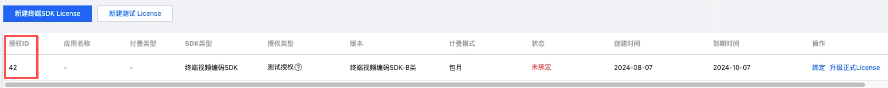
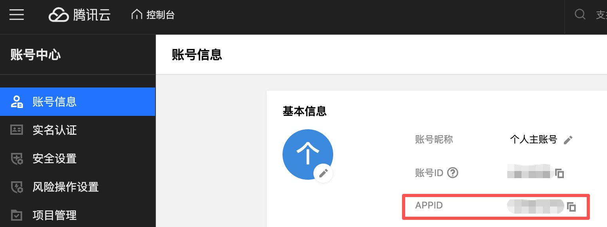
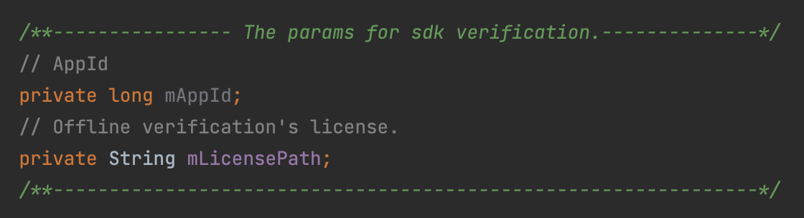

# 1 Run the Demo
## 1.1 SDK Authorization Application
Please first activate the Media Processing Service (MPS) [Console](https://console.cloud.tencent.com/mps) on the Tencent Cloud official website. Then follow the [guide](https://cloud.tencent.com/document/product/862/109789) to self-service activate SDK test authorization, obtain the Authorization ID, and bindthe App package name.    
    
In Tencent Cloud - Account Center - [Account Information](https://console.cloud.tencent.com/developer), obtain your account's APPID.    
    

## 1.2 Demo Project Compilation and Running
Download the Demo project [source code](./demo/tsr-android-demo/tsr-opengl-demo).    
Change the Demo package name to the package name bound in the previous "SDK Authorization Application" step.    
Configure the obtained Authorization ID and APPID into the Demo project: you can add them in the local.properties file under the project root directory
```
App_Id=your_APPID
Auth_Id=your_Authorization_ID
```
Or you can also write them directly in the TsrSdkHelper.java file of the project    
    
Then you can compile and run the Demo.

*Note: The SDK version in the ./SRPlayer/app/libs folder of the Demo project may be outdated. You can contact your Tencent Cloud business representative to obtain the latest version.*

---

# 2 App SDK Integration
## 2.1 Add and Configure SDK

Place the TsrSdk related AAR files into the libs folder of the App project.
Configure in the App's build.gradle:
```
android {
    packagingOptions {
        // If there are multiple, only one needs to be integrated.
        pickFirst '**/libc++_shared.so'
        // Must declare excluding this so
        excludes += ['**/libqqneuroedge*.so']
        // If the app does not use libmmkv.so, you can exclude the armeabi-v7a architecture to reduce package size. Note that the arm64-v8a architecture must be retained.
        excludes += ['**/armeabi-v7a/libmmkv.so']
    }
}

dependencies {
     implementation fileTree(dir: "libs", include: ["*.jar", "*.aar"])
}
```
Configure in AndroidManifest.xml:
```
 <uses-permission android:name="android.permission.INTERNET"/>

 // If Android targetSdkVersion is greater than or equal to 31, you need to add the following tags, otherwise the professional version features will not be available
 <application>
     <uses-native-library
         android:name="libOpenCL.so"
         android:required="false" />

     <uses-native-library
         android:name="libOpenCL-car.so"
         android:required="false" />

     <uses-native-library
         android:name="libOpenCL-pixel.so"
         android:required="false" />
 </application>
```

---

## 2.2 Using the SDK


### **2.2.1 TSRSdk**
[TSRSdk](https://tencentyun.github.io/TSR/android-docs/latest/com/tencent/mps/tie/api/TSRSdk.html) includes init and deInit methods. The init method is used to initialize the SDK, and the deInit method is used to release resources.

1. To initialize the TSRSdk for online authentication, you need to pass in the **APPID** and **Authorization ID** for online authentication, and also pass in TSRSdk.TSRSdkLicenseVerifyResultCallback to obtain the results of online authentication. In addition, you need to pass in a TSRLogger to obtain the SDK logs. Here is an example code:

```
    TSRSdkLicenseVerifyResultCallback callback = new TSRSdkLicenseVerifyResultCallback() {
    public void onTSRSdkLicenseVerifyResult(TSRSdkLicenseStatus status) {
        if (status == TSRSdkLicenseStatus.AVAILABLE) {
           // Creating TSRPass for super-resolution rendering
        } else {
           // Do something when the verification of sdk's license failed.
        }
    }
  };
  TSRSdk.getInstance().init(context, appId, authId, callback, logger);
```


2. When you no longer need to use TSRSdk, you can call the deInit method of TSRSdk.

### **2.2.2 TSRPass**
[TSRPass](https://tencentyun.github.io/TSR/android-docs/latest/com/tencent/mps/tie/api/TSRPass.html) is a class used for super-resolution rendering. When creating a TSRPass, you need to pass in TSRAlgorithmType to set the super-resolution algorithm type.

**Note: TSRPass is not thread-safe, and the methods of TSRPass must be called in the same thread.**

In the TSRAlgorithmType enumeration, there are STANDARD, STANDARD_COLOR_RETOUCHING_EXT, PROFESSIONAL, and PROFESSIONAL_COLOR_RETOUCHING_EXT four algorithm running modes:
1. **STANDARD (Standard Super Resolution) mode**: Provides fast super-resolution processing speed, suitable for scenes with high real-time requirements. In this mode, significant image quality improvement can be achieved.
2. **STANDARD_COLOR_RETOUCHING_EXT (Standard Super Resolution + Enhancement) mode**: Optimizes color performance on top of standard super-resolution.
3. **PROFESSIONAL (Professional Super Resolution) mode**: Ensures high image quality while requiring higher device performance. It is suitable for scenes with high image quality requirements and is recommended for use on mid-to-high-end smartphones.
4. **PROFESSIONAL_COLOR_RETOUCHING_EXT (Professional Super Resolution + Enhancement) mode**: Optimizes color performance on top of professional super-resolution.

It includes `init`, `reInit`, `render`, and `deInit` methods. Before using TSRPass, you need to call the `init` method to initialize. If you need to update the input image dimensions or scaling factor without creating a new TSRPass instance, you can use the `reInit` method. After using it, you need to call the `deInit` method to release resources.


The following is a super-resolution code example:
```
// Create a TSRPass object using the constructor.
TSRPass tsrPass = new TSRPass(TSRPass.TSRAlgorithmType.PROFESSIONAL); // STANDARD, STANDARD_COLOR_RETOUCHING_EXT, PROFESSIONAL, PROFESSIONAL_COLOR_RETOUCHING_EXT

// The code below must be executed in the same glThread.
//----------------------GL Thread---------------------//

// Initialize TSRPass and set the input image width, height, and srRatio.
TSRPass.TSRInitStatusCode initStatus = tsrPass.init(inputWidth, inputHeight, srRatio);

if (initStatus == TSRPass.TSRInitStatusCode.SUCCESS) {
   // Perform super-resolution rendering and get the enhanced texture ID.
   int outputTextureId = tsrPass.render(inputTextureId);

   // Reinitialize if there are changes in image dimensions or srRatio.
   TSRPass.TSRInitStatusCode reInitStatus = tsrPass.reInit(newInputWidth, newInputHeight, newSrRatio);
   if (reInitStatus == TSRPass.TSRInitStatusCode.SUCCESS) {
      outputTextureId = tsrPass.render(inputTextureId);
   } else {
      // Handle reinitialization failure
   }

   // Release resources when no longer needed.
   tsrPass.deInit();
} else {
   // Handle initialization failure
}

//----------------------GL Thread---------------------//
```

The TSRPass class also provides interfaces for managing and optimizing the professional super-resolution (Pro SR) functionality during the super-resolution rendering process. Below is a detailed introduction to these interfaces:

1. **enableProSRAutoFallback(int consecutiveTimeoutFrames, int timeoutDurationMs, FallbackListener listener):**
   This method enables the automatic fallback mechanism for super-resolution processing. This method should be called before the initialization method. It configures the automatic fallback parameters; if consecutive consecutiveTimeoutFrames frames exceed the specified timeoutDurationMs, the system will trigger a fallback to the standard algorithm, ensuring smooth playback and avoiding stuttering due to insufficient device performance. Note that this method only takes effect when the algorithm type used to create TSRPass is set to PROFESSIONAL or PROFESSIONAL_COLOR_RETOUCHING_EXT. Additionally, a fallback listener can be provided to handle fallback events. When a fallback is triggered, the fallback listener's onFallback() method will be called, allowing users to implement custom behavior in response to the fallback event.

2. **disableProSRAutoFallback():**
   This method disables the automatic fallback mechanism for super-resolution processing. This method should be called to turn off the automatic fallback feature previously enabled using enableProSRAutoFallback. Once invoked, the system will no longer trigger a fallback based on the configured parameters.

3. **benchmarkProSR(int inputWidth, int inputHeight, float srRatio):**
   This method evaluates the rendering time consumption of the professional algorithm. It assesses the execution time in milliseconds based on the given input dimensions. This method should not be called on the main thread, as it may take approximately 2 to 5 seconds to complete. This method only takes effect when the algorithm type used to create TSRPass is not set to STANDARD. If the algorithm execution fails for any reason, this method will return -1.

4. **forceProSRFallback(boolean enable):**
   This method switches between the professional and standard algorithms. When enable is true, the system will switch to the standard algorithm; otherwise, it will use the professional algorithm. This method only takes effect when the algorithm type used to create TSRPass is not set to STANDARD.

These interfaces provide developers with flexible control options to optimize the performance and user experience of super-resolution rendering.

### **2.2.3 TIEPass**
[TIEPass](https://tencentyun.github.io/TSR/android-docs/latest/com/tencent/mps/tie/api/TIEPass.html) is a class used for image enhancement rendering. When creating a TIEPass, you need to pass in TIEAlgorithmType to set the image enhancement algorithm type: **STANDARD (Standard Enhancement) mode** or **PROFESSIONAL (Professional Enhancement) mode**. It includes `init`, `reInit`, `render`, and `deInit` methods. Before using TIEPass, you need to call the `init` method to initialize. If you need to update the input image dimensions without creating a new TIEPass instance, you can use the `reInit` method. After using it, you need to call the `deInit` method to release resources.


**Note: TIEPass is not thread-safe, and TIEPass methods must be called in the same thread.**

The following is a code example:
```
// Create a TIEPass object using the constructor.
TIEPass tiePass = new TIEPass(TIEPass.TIEAlgorithmType.PROFESSIONAL);


// The code below must be executed in the same glThread.
//----------------------GL Thread---------------------//

// Initialize TIEPass and set the input image width and height.
TIEPass.TIEInitStatusCode initStatus = tiePass.init(inputWidth, inputHeight);

if (initStatus == TIEPass.TIEInitStatusCode.SUCCESS) {
   // If the type of inputTexture is TextureOES, you must transform it to Texture2D.
   // Conversion code can be written according to actual requirements.
   
   // Perform image enhancement rendering on the input OpenGL texture and get the enhanced texture ID.
   int outputTextureId = tiePass.render(inputTextureId);
   
   // Reinitialize with new dimensions if needed.
   TIEPass.TIEInitStatusCode reInitStatus = tiePass.reInit(newInputWidth, newInputHeight);
   if (reInitStatus == TSRPass.TSRInitStatusCode.SUCCESS) {
      outputTextureId = tiePass.render(inputTextureId);
   } else {
      // Handle reinitialization failure
   }

   // Release resources when the TIEPass object is no longer needed.
   tiePass.deInit();
} else {
   // Handle initialization failure
}

//----------------------GL Thread---------------------//
```

The TIEPass class provides interfaces for managing and optimizing the professional image enhancement (Pro IE) functionality during the image enhancement process. Below is a detailed introduction to these interfaces:

1. **enableProIEAutoFallback(int consecutiveTimeoutFrames, int timeoutDurationMs, FallbackListener listener):**
    This method enables the automatic fallback mechanism for image enhancement processing. This method should be called before the initialization method. It configures the automatic fallback parameters; if consecutive consecutiveTimeoutFrames frames exceed the specified timeoutDurationMs, the system will trigger a fallback to the standard algorithm, ensuring smooth playback and avoiding stuttering due to insufficient device performance. Note that this method only takes effect when the algorithm type used to create TIEPass is set to PROFESSIONAL. Additionally, a fallback listener can be provided to handle fallback events. When a fallback is triggered, the fallback listener's onFallback() method will be called, allowing users to implement custom behavior in response to the fallback event.
   
2. **disableProIEAutoFallback():**
   This method disables the automatic fallback mechanism for image enhancement processing. This method should be called to turn off the automatic fallback feature previously enabled using enableProIEAutoFallback. Once invoked, the system will no longer trigger a fallback based on the configured parameters.

3. **benchmarkProIE(int inputWidth, int inputHeight):**
   This method evaluates the rendering time consumption of the professional algorithm. It assesses the execution time in milliseconds based on the given input dimensions. This method should not be called on the main thread, as it may take approximately 2 to 5 seconds to complete. This method only takes effect when the algorithm type used to create TIEPass is not set to STANDARD. If the algorithm execution fails for any reason, this method will return -1.

4. **forceProIEFallback(boolean enable):**
   This method switches between the professional and standard algorithms. When enable is true, the system will switch to the standard algorithm; otherwise, it will use the professional algorithm. This method only takes effect when the algorithm type used to create TIEPass is not set to STANDARD.

These interfaces provide developers with flexible control options to optimize the performance and user experience of image enhancement.

### **2.2.4 TSRLogger**
[TSRLogger](https://tencentyun.github.io/TSR/android-docs/latest/com/tencent/mps/tie/api/TSRLogger.html) is used to receive logs from the SDK internals. Please write these logs to a file for external network problem positioning.

# **3 SDK API Documentation**
You can click on the link to view the TSRSDK API documentation, which contains interface comments and usage examples.

[TSRSDK ANDROID API Documentation](https://tencentyun.github.io/TSR/android-docs/latest/index.html)
