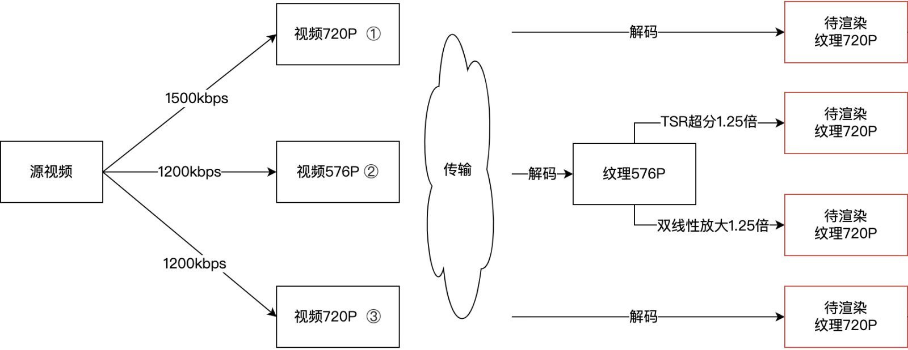
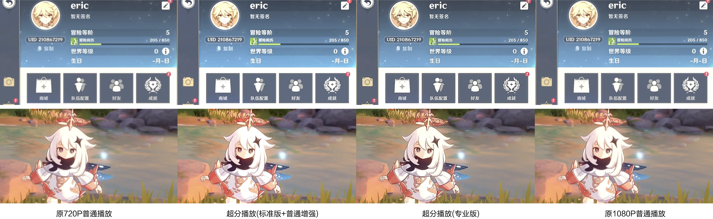

# 终端视频增强SDK
[[English]](README_en.md)

终端视频增强SDK，基于高效的图像处理算法和AI模型推理能力，实现终端视频超分辨率、画质增强等功能。超分辨率是指在终端播放时，在尽量保持画质的前提下将原始视频进行高效的上采样，以适应显示设备的播放分辨率。画质增强是指改善图像的视觉质量，使其更加清晰细腻和真实。  

[视频对比](https://cg-sdk-1258344699.cos.ap-nanjing.myqcloud.com/personal/handleychen/202409%E5%AF%B9%E5%A4%96%E8%AF%84%E6%B5%8B/%E7%94%B5%E5%BD%B1%E7%89%87%E6%AE%B5landscape/%E5%8E%9F%E6%99%AE%E6%A0%87%E6%A0%87%E4%B8%93_540land.html)

终端视频增强SDK分为标准版与专业版：
* 标准版的特点是能够以较低的计算耗时和功耗实现良好的超分辨率效果，适配各种性能的手机。

* 专业版的优势在于图像效果更佳。除了进行上采样外，专业版还利用AI模型推理生成原图像缺失的纹理细节，从而实现图像增强和超分辨率处理。需要注意的是，专业版对设备的算力有一定要求，建议在中高端手机上使用。

各版本具体功能详情如下： 

| 功能点           | 标准版 | 专业版 |
| ---------------- | ------ | ------ |
| 标准超分辨率     | 支持   | 支持   |
| 标准画质增强    (亮度/色彩饱和度/对比度/锐化)| 支持   | 支持   |
| 专业超分辨率     |        | 支持   |
| 专业画质增强      |        | 支持   |  

## 1. 使用场景

### (1) 终端播放器增强：提高视频播放的画质、流畅度体验。  

### (2) 节约成本：降低视频分发的分辨率和码率，再通过终端播放增强减小体验损失。

例如，云游戏场景，利用端上实时视频超分辨率的能力，可以降低云端渲染和编码的算力，并且节省传输带宽，节约成本。如下例子，云端传输720P(5.6Mbps)的游戏画面在终端播放实时超分到1080P，观看效果接近云端传输1080P(8.2Mbps)的画面，节省30%带宽。

### (3) 多分辨率视频合成

使用超分辨率算法将不同分辨率的视频统一为相同分辨率，然后进行高清合成。如果采用默认的放大算法，低分辨率视频可能会变得模糊。而使用超分辨率算法进行放大，则能更好地保持视频的清晰度。

## 2. 产品优势
<table>
  <tr>
    <th width=100px>类目</th>
    <th>说明 </th>
  </tr>
  <tr height=180px;>
    <td align=center>性能</td>
    <td>
      <li>场景广泛：适用各种分辨率的处理。支持360P至4K的超分辨率处理，以及360P至1080P的画质增强处理。
      <li>高效处理：标准版算法在2016年千元机上处理720P超分1.5倍至1080P平均每帧耗时为1ms以内；专业版算法在2020年千元机上处理540P超分2倍至1080P平均帧耗时为20ms，720P超分1.5倍平均帧耗时为29ms。
      <li>使用灵活：具备根据设备性能自适应选择算法的能力，在清晰播放的同时拒绝卡顿。
    </td>
  </tr>
  <tr height=180px;>
    <td align=center>兼容性</td>
    <td><li>支持市面上绝大多数Android与iOS主流机型。</td>
  </tr>
</table>

## 3.产品性能
### 标准版超分辨率

### 专业版超分辨率

### 专业版画质增强

## 4. 兼容性
* 标准版：
  - Android：系统版本Android 5.0及以上；
  - iOS：iPhone 5s及以上机型，且系统版本在iOS 12及以上。
* 专业版：
  - Android： 系统版本Android 5.0及以上，且支持OpenCL 1.2及以上版本；
  - iOS：系统版本iOS 16及以上。

## 5. 包大小
* 标准版：Android AAR约 0.3MB（单arm64-v8a架构）；iOS Framework 0.4MB。
* 专业版：Android AAR约 2.1MB（单arm64-v8a架构）；iOS Framework 1.9MB。

## 6. 体验Demo

<table>
  <tr>
    <th width=150px;>系统</th>
    <th width=150px;>二维码</th>
    <th width=150px;>链接</th>
  </tr>
  <tr>
    <td>Android</td>
    <td></td>
    <td><a href="https://cg-sdk-1258344699.cos.ap-nanjing.myqcloud.com/tsr/pro-demo-android/MPSDemo_v0.5.6-12-f17f911_202411071807.apk">MPSDemo</a></td>
  </tr>
</table>

   
  

## 7. 接入指引
参考[Android](Android%20接入指南.md)、[iOS](iOS%20接入指南.md)接入指南。
