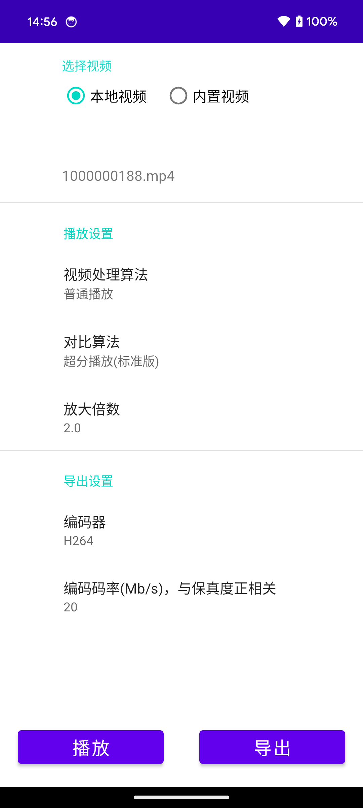
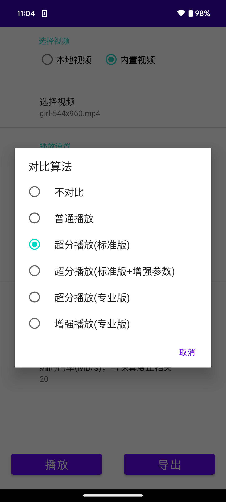
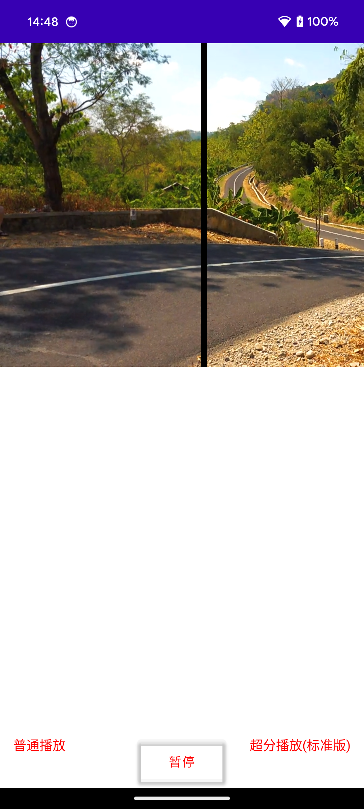

# 终端视频增强SDK

## 1.产品介绍
终端视频增强SDK，基于高效的图像处理算法和AI模型推理能力，实现终端视频超分辨率、画质增强等功能。  
各版本具体功能详情如下： 

| 功能点           | 标准版 | 专业版 |
| ---------------- | ------ | ------ |
| 标准超分辨率     | 支持   | 支持   |
| 标准超分+增强    (对比度/亮度/色彩饱和度)| 支持   | 支持   |
| 专业超分辨率     |        | 支持   |
| AI画质增强      |        | 支持   |  

 

>从左到右依次为540P原视频、普通播放、超分播放(标准版)、超分播放(标准版+增强)、超分播放(专业版)。
[链接](https://cg-sdk-1258344699.cos.ap-nanjing.myqcloud.com/personal/handleychen/20240621%20%E5%AF%B9%E5%A4%96%E4%BB%8B%E7%BB%8D%E6%95%88%E6%9E%9C/index%28%E6%A8%A1%E7%89%88-%E5%8E%9F%E6%99%AE%E6%A0%87%E6%A0%87%E4%B8%93%29.html)
  
 
  

>从左到右依次为540P原视频、增强视频。[链接](https://cg-sdk-1258344699.cos.ap-nanjing.myqcloud.com/personal/handleychen/20240621%20%E5%AF%B9%E5%A4%96%E4%BB%8B%E7%BB%8D%E6%95%88%E6%9E%9C/index%28%E6%A8%A1%E7%89%88-%E5%8E%9F%E5%A2%9E%29.html)

* 标准版的优势是性能，我们的算法能以极低的耗时和功耗，实现较好的超分辨率效果。
* 标准版里还提供了图像增强能力，可以调整图像的对比度、亮度、色彩饱和度。
* 专业版的优势是效果，它通过AI模型推理，能生成原图像缺失的纹理细节，实现最好的图像增强和超分辨率效果。对设备性能有一定要求，建议在中高端手机上使用。

## 2.产品性能
### 标准版超分辨率

### 专业版超分辨率

### AI画质增强

## 3. 使用场景

1、终端播放器增强，提高视频播放的画质、流畅度体验。  

2、节约成本，降低视频分发的分辨率和码率，再通过终端播放增强来减小体验损失。

## 4. 兼容性
* Android平台：Android5.0以上（API 21，OpenGL ES 3.1）。

* iOS平台：适用于 iPhone 5s及更高版本的设备，最低系统版本为iOS 12。

## 5. 包大小
* 标准版：Android AAR约0.6M（含arm64-v8a和armeabi-v7a）；iOS Framework 0.35MB。

* 专业版：Android AAR 4.08MB（含arm64-v8a和armeabi-v7a）；iOS Framework 6.03MB。

## 6. Demo体验
[下载链接](https://cg-sdk-1258344699.cos.ap-nanjing.myqcloud.com/tsr/pro-demo-android/SRPlayer.apk)  
用手机系统浏览器打开，下载安装   
|Android|
| :- |
| |

  
  
  

## 7. 接入指引
参考[接入指南](https://github.com/tencentyun/TSR/blob/main/%E6%8E%A5%E5%85%A5%E6%8C%87%E5%8D%97.md)
