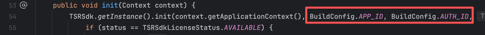

# **TSRSDK接入指南**
## 1. **SDK授权申请**
请联系您的腾讯云商务开通服务。您需要提供将要集成SDK的App的这些信息：腾讯云账号APPID、App签名证书信息(签名证书的序列号、发布者、所有者)、App包名。

APPID可以在您的腾讯云【账号中心】->【账号信息】->【基本信息】中查看。
App签名证书信息可以使用keytool命令查看，例如
```keytool -list -v -keystore test.keystore```


提供的信息
|信息|值|
| :- | :- |
|APPID|12345678|
|包名|com.tencent.mps.srplayer|
|序列号|17ccecf2|
|所有者|test|
|发布者|test|

离线授权方案分为授权申请和授权验证两个过程，其中授权申请在授权有效期内，只会进行一次。授权服务开通后，我们会给您提供离线的license，用于在TSRSDK初始化时进行鉴权。授权服务具有有效期限，当授权过期失效后需要重新获取授权。

## 2. **SDK接入指南**
### **2.1 程序流程**


#### **2.1.1 TsrSdk**
[TsrSdk](https://tencentyun.github.io/TSR/com/tencent/mps/tsr/api/TsrSdk.html)包括init和release两个方法。init方法用于初始化SDK，release方法用于释放资源。

1. 离线鉴权初始化[TsrSdk](https://tencentyun.github.io/TSR/com/tencent/mps/tsr/api/TsrSdk.html#init(long,java.lang.String,com.tencent.mps.tsr.api.TsrLogger))，您需要传入**APPID、license路径**用于离线鉴权，除此之外，还需要传入一个 [TsrLogger](https://tencentyun.github.io/TSR/com/tencent/mps/tsr/api/TsrLogger.html)，用于获取SDK的日志。[init](https://tencentyun.github.io/TSR/com/tencent/mps/tsr/api/TsrSdk.html#init(long,java.lang.String,com.tencent.mps.tsr.api.TsrLogger))会有返回值[SdkLicenseStatus]([https://tencentyun.github.io/TSR/com/tencent/mps/tsr/api/TsrSdk.html#init(long,java.lang.String,com.tencent.mps.tsr.api.TsrLogger)](https://tencentyun.github.io/TSR/com/tencent/mps/tsr/api/TsrSdk.SdkLicenseStatus.html)) ，表示license校验的结果。下面是示例代码：
```
String licensePath = "----path to you sdk license.----";
TsrSdk tsrSdk = TsrSdk.getInstance();
SdkLicenseStatus status = tsrSdk.init(appId, licensePath, logger);
if (status == SdkLicenseStatus.AVAILABLE) {
// Perform super-resolution rendering using TsrPass class.
} else {
// Do something when the verification of sdk's license failed.
}
```


2. 当您已经不需要使用TsrSdk时，需要调用TsrSdk的release方法，释放资源。<font color="red">**注意：在调用TsrSdk的release方法前，确保所有TsrPass已经被release，否则会有意想不到的问题。**</font>
```
// If you have created TsrPass, you should release it before release TsrSdk.
tsrPass.release();
// Release resources when the TsrSdk object is no longer needed.
tsrSdk.release();
```
#### **2.1.2 TsrPass**
[TsrPass](https://tencentyun.github.io/TSR/com/tencent/mps/tsr/api/TsrPass.html)是用于进行超分辨率渲染的类，它包括了init、render和release方法。在使用TsrPass前，您需要调用init方法进行初始化。在使用结束后，您需要调用release方法释放资源。

以下是代码示例：
```
// Create a TsrPass object using the constructor.
TsrPass tsrPass = new TsrPass();

// The code below must be executed in glThread.
//----------------------GL Thread---------------------//
// Init TsrPass
tsrPass.init(inputWidth, inputHeight, srRatio);
// If the type of inputTexture is TextureOES, you must transform it to Texture2D.
int outputTextureId = tsrPass.render(inputTextureId);

//----------------------GL Thread---------------------//

// Release resources when the TsrPass object is no longer needed.
tsrPass.release();
```

#### **2.1.3 TsrLogger**
[TsrLogger](https://tencentyun.github.io/TSR/com/tencent/mps/tsr/api/TsrLogger.html)用于接收SDK内部的日志，请将这些日志写到文件，以便定位外网问题。
### **2.2 API文档**
您可以点击连接查看TSRSDK的API文档，内含接口注释与调用示例。

[TSRSDK API文档](https://tencentyun.github.io/TSR/com/tencent/mps/tsr/api/package-summary.html)
### **2.3 体验Demo**
#### **2.3.1 安装包**
请联系您的腾讯云商务获取。
#### **2.3.2 源码**
我们开放了体验Demo的工程源码，供您接入参考。

为了编译运行，您需要先联系腾讯云商务获取SDK和授权，再配置到Demo工程中。步骤如下：

1. 将SDK放在工程的libs文件夹下（可以自定义），在settings.gradle中添加
```
dependencyResolutionManagement {
    repositoriesMode.set(RepositoriesMode.FAIL_ON_PROJECT_REPOS)
    repositories {
        mavenLocal()
        maven { url 'https://jitpack.io' }
        google()
        mavenCentral()

        flatDir {
            dirs "libs"
        }
    }
    
        versionCatalogs {
        libs {
            version('versionName', '1.0.0')
            version('versionCode', '2')
            version('compileSdk', '32')
            version('minSdk', '21')
            version('targetSdk', '32')
        }
    }
}
```

然后在app目录下的build.gradle中配置
```
implementation(name:'tsrsdk', ext:'aar')
```


2. 在MainActivity.java下配置初始化参数，离线校验初始化需要APPID与licensePath。

   

如果您只是想快速的运行demo，您可以把license直接放入assets文件夹内，demo会去读取assets文件夹中的文件拷贝到sdcard中。

3. 对APK进行签名
- 在Android Studio中，找到【File】-> 【Project Structure】 -> 【Modules】-> 【Signing Configs】中配置您的签名证书。
- 或者您可以在【Build】-> 【Generate Signed Bundle / APK】使用证书生成签名的APK
- 无论您使用哪种方式，<font color="red">**请确保配置的签名证书与提供给我们的信息一致。**</font>

4. 运行demo


