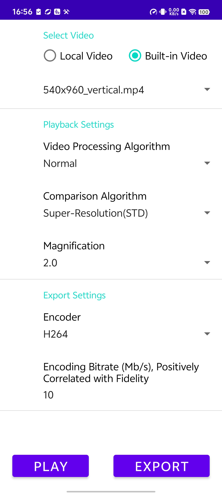
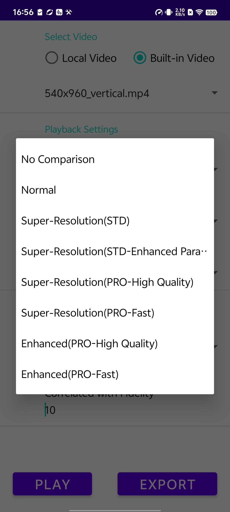
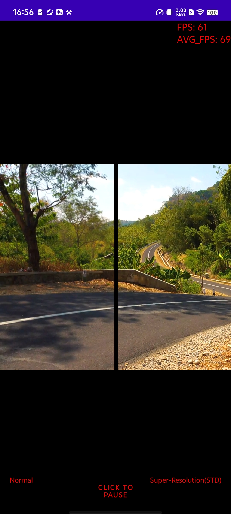

# Terminal Video Enhancement SDK
- [[简体中文]](README.md)

## 1. Product Introduction
The Terminal Video Enhancement SDK, based on efficient image processing algorithms and AI model inference capabilities, realizes terminal video super-resolution and image quality enhancement functions. Super-resolution refers to efficiently upsampling the original video while maintaining the image quality as much as possible during terminal playback to adapt to the display device's playback resolution. Image quality enhancement refers to improving the visual quality of the image, making it more clear, delicate, and realistic.
The specific functionality details of each version are as follows:

| Function Point           | Standard Edition | Professional Edition |
| ----------------        | ------          | ------              |
| Standard Super Resolution | Support        | Support            |
| Standard Super Resolution + Enhancement    (Brightness/Color Saturation/Contrast)| Support   | Support   |
| Professional Super Resolution |            | Support           |
| AI Image Quality Enhancement |            | Support           |

 

[vidoe contrast](https://cg-sdk-1258344699.cos.ap-nanjing.myqcloud.com/personal/handleychen/202409%E5%AF%B9%E5%A4%96%E8%AF%84%E6%B5%8B/%E7%94%B5%E5%BD%B1%E7%89%87%E6%AE%B5landscape/%E5%8E%9F%E6%99%AE%E6%A0%87%E6%A0%87%E4%B8%93_540land.html)

* The advantage of the standard version is performance. Our algorithm can achieve better super-resolution effects with extremely low latency and power consumption. It is suitable for almost all performance smartphones.
* The standard version also provides image enhancement capabilities, allowing adjustment of image brightness, color saturation, and contrast.
* The advantage of the professional version is the effect. By using AI model inference, it can generate the missing texture details of the original image, achieving the best image enhancement and super-resolution effects. It requires device computing power and is recommended for use only on mid-to-high-end smartphones.

## 2. Product Performance
### Standard Super Resolution
Tested on Pixel6 mobile phone, the GPU time for processing one frame of the standard super-resolution image is less than 1ms.

Tested on high, medium, and low-end models, after opening super-resolution, the increase in CPU/memory/GPU/power consumption is small, and there is no impact on the frame rate. 4K videos can also be processed in real-time on mid-range smartphones.

### Professional Super Resolution
#### FAST

#### HIGH QUALITY

### AI Image Quality Enhancement
#### FAST

#### HIGH QUALITY

## 3. Use Cases

1. Terminal player enhancement, improving video playback quality and smoothness experience.
   

2. Save costs, reduce the resolution and bitrate of video distribution, and then reduce the experience loss through terminal playback enhancement.
   

For example, in a cloud gaming scenario, by utilizing the real-time video super-resolution capability on the terminal, the computing power of cloud rendering and encoding can be reduced, transmission bandwidth can be saved, and costs can be saved. In the following example, the terminal plays a 720P (5.6Mbps) game screen transmitted by the cloud in real-time super-resolution to 1080P, and the viewing effect is close to the 1080P (8.2Mbps) screen transmitted by the cloud, saving 30% of bandwidth.

## 4. Compatibility
* Standard Edition:
  - Android 5.0 and above;
  - iPhone 5s and iOS 12 and above. High device compatibility rate.
* Professional Edition:
  - Android 5.0 and above;
  - iOS: low computing power (FAST) algorithm iOS 15 and above, high computing power (HIGH_QUALITY) algorithm iOS 16 and above.

## 5. Package Size
* Standard Edition: Android AAR about 0.3MB (single arm64-v8a architecture); iOS Framework 0.4MB.
* Professional Edition: Android AAR about 2.1MB (single arm64-v8a architecture); iOS Framework 1.9MB.

## 6. Demo Experience
[Download Link](https://cg-sdk-1258344699.cos.ap-nanjing.myqcloud.com/tsr/pro-demo-android/SRPlayer.apk)  
Open with the phone's system browser, download and install   
|Android|
| :- |
| |

  
  
  

## 7. Quick Start
Refer to [Android](Android%20Quick%20Start.md), [iOS](iOS%20Quick%20Start.md) quick start.
