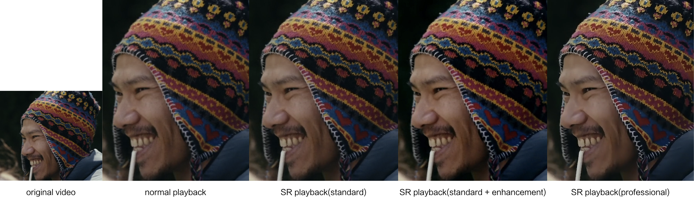
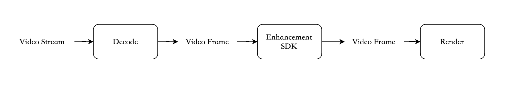
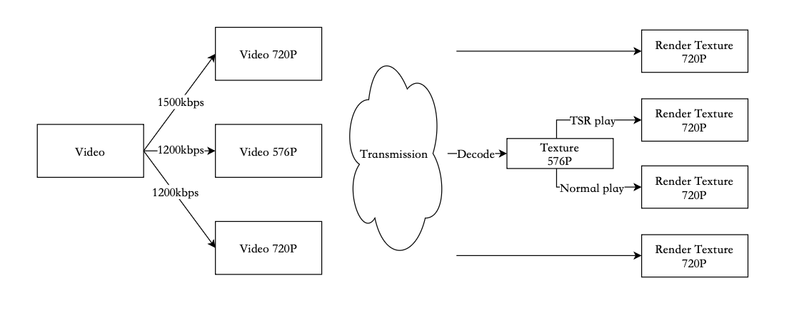
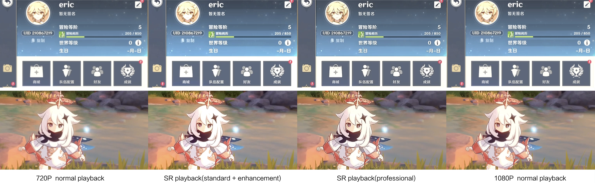

# Client Video Enhancement SDK
- [[简体中文]](README.md)

## Product Introduction
The Client Video Enhancement SDK, based on efficient image processing algorithms and AI model inference capabilities, realizes client video super-resolution and image quality enhancement functions. Super-resolution refers to efficiently upsampling the original video while maintaining the image quality as much as possible during client playback to adapt to the display device's playback resolution. Image quality enhancement refers to improving the visual quality of the image, making it more clear, delicate, and realistic.

<a href="https://cg-sdk-1258344699.cos.ap-nanjing.myqcloud.com/personal/handleychen/202409%E5%AF%B9%E5%A4%96%E8%AF%84%E6%B5%8B/%E7%94%B5%E5%BD%B1%E7%89%87%E6%AE%B5landscape/%E5%8E%9F%E6%99%AE%E6%A0%87%E6%A0%87%E4%B8%93_540land.html">[video contrast]</a>

 
 
The Client Video Enhancement SDK is available in Standard and Professional editions:

* The advantage of the Standard Edition is performance. Our algorithm can achieve better super-resolution effects with extremely low latency and power consumption. It is suitable for almost all performance smartphones. The Standard Edition also provides image enhancement capabilities, allowing adjustment of image brightness, color saturation, and contrast.

* The advantage of the Professional Edition is the effect. In addition to upsampling, it uses AI model inference to generate the missing texture details of the original image, achieving better image enhancement and super-resolution effects. It requires device computing power and is recommended for use only on mid-to-high-end smartphones.

### Core Feature Matrix:

| Feature                      | Standard Edition | Professional Edition |
|--------------------------| ------ |----------|
| Standard Image Quality Enhancement                   | Support   | Support       |
| Standard Super Resolution                   | Support   | Support       |
| Standard Super Resolution + Color Enhancement            | Support   | Support       |
| Professional Image Quality Enhancement (Detail Enhancement, Denoising, Color Enhancement, Deblurring) |        | Support       |
| Professional Super Resolution                   |        | Support       |
| Professional Super Resolution + Color Enhancement            |        | Support       |

### Edition Selection Recommendations
* Standard Edition: Suitable for performance-sensitive devices, meeting basic image quality improvement needs.
* Professional Edition: Designed for mid-to-high-end devices, achieving high image quality experience through deep learning models.

## 1. Use Cases

### (1) Client Playback Quality Enhancement
Through real-time super-resolution and image quality restoration technology, upgrade 480P/720P video to 1080P display quality, adapting to high-resolution mobile device screens and improving streaming playback clarity and smoothness experience.

### (2) Bandwidth Cost Optimization
In scenarios such as cloud gaming and live streaming, achieve a "low bitrate transmission + high clarity presentation" solution through client-side super-resolution technology. Tests show that transmitting 720P (5.6Mbps) video with client-side super-resolution to 1080P achieves visual quality close to native 1080P (8.2Mbps) streams, saving 30% of bandwidth.

<a href="https://cg-sdk-1258344699.cos.ap-nanjing.myqcloud.com/personal/handleychen/202409%E5%AF%B9%E5%A4%96%E8%AF%84%E6%B5%8B/%E5%8E%9F%E7%A5%9E%E6%B8%B8%E6%88%8Flandscape/%E5%8E%9F%E6%99%AE%E6%A0%87%E6%A0%87%E4%B8%93%E4%B8%93%E7%9B%AE_720land.html">[video contrast]</a>

### (3) Multi-source Video Standardization Processing
In scenarios such as video editing and multi-screen compositing, intelligently unify materials of different resolutions through super-resolution, avoiding edge blurring caused by traditional interpolation algorithms and ensuring visual consistency of composited video.

## 2. Product Advantages
<table>
  <tr>
    <th width=100px>Category</th>
    <th>Description</th>
  </tr>
  <tr height=180px;>
    <td align=center>Performance</td>
    <td>
      <li>Wide scenarios: Can handle various resolutions and is suitable for various scenarios.
      <li>Efficient processing: The Standard Edition algorithm processes 720P super-resolution 1.5x to 1080P with an average frame time of less than 1ms on a 2016 budget phone; the Professional Edition algorithm processes 540P super-resolution 2x to 1080P with an average frame time of 20ms and 720P super-resolution 1.5x with an average frame time of 29ms on a 2020 budget phone.
      <li>Flexible usage: Capable of adaptively selecting algorithms based on device performance, ensuring clear playback while avoiding stuttering.
    </td>
  </tr>
  <tr height=180px;>
    <td align=center>Compatibility</td>
    <td><li>Supports the vast majority of mainstream Android and iOS devices on the market.</td>
  </tr>
</table>

## 3. Performance Reference

| Device | Video | Normal Playback Power (mW) | Enhanced Playback Power (mW) | Power Increase (mW) | Latency (ms) |
| :--- | :--- | :---: | :---: | :---: | :---: |
| iPhone 13 | 480P | 668 | 828 | 160 | 12 |
| iPhone 15 Pro | 480P | 751 | 904 | 153 | 9 |
| vivo X80 (Dimensity 9000) | 480P | 742 | 1920 | 1178 | 9 |
| Redmi K80 (Snapdragon 8 Gen 3) | 480P | 1090 | 1374 | 284 | 8 |

| Device | Video | Normal Playback Power (mW) | Enhanced Playback Power (mW) | Power Increase (mW) | Latency (ms) |
| :--- | :--- | :---: | :---: | :---: | :---: |
| iPhone 13 | 720P | 854 | 1277 | 423 | 14 |
| iPhone 15 Pro | 720P | 726 | 1081 | 355 | 13 |
| vivo X80 (Dimensity 9000) | 720P | 752 | 2186 | 1434 | 16 |
| Redmi K80 (Snapdragon 8 Gen 3) | 720P | 1116 | 1710 | 594 | 14 |

## 4. Device Compatibility
| Edition  | Android Requirements | iOS Requirements |
|-----|-----------|-------|
| Standard Edition | ≥5.0 (OpenGL ES 3.1+)        | ≥12   |
| Professional Edition | ≥5.0 (OpenCL 1.2+)        | ≥16   |

## 5. Package Size
| OS         | Standard Edition   | Professional Edition    |
|--------------|-------|--------|
| Android (single architecture) | 0.3MB | 2.1MB  |
| iOS (real device)      | 0.4MB | 3.38MB |

## 6. Demo Experience

<table>
  <tr align=center>
    <th width=150px;>OS</th>
    <th width=150px;>QR Code</th>
    <th width=150px;>Link</th>
  </tr>
  <tr align=center>
    <td>Android</td>
    <td></td>
    <td> <a href="https://cg-sdk-1258344699.cos.ap-nanjing.myqcloud.com/tsr/pro-demo-android/MPSDemo.apk">MPSDemo</a> </td>
  </tr>
</table>

 

## 7. Integration Guide
Refer to [Android](Android%20Quick%20Start.md), [iOS](iOS%20Quick%20Start.md) integration guide.
