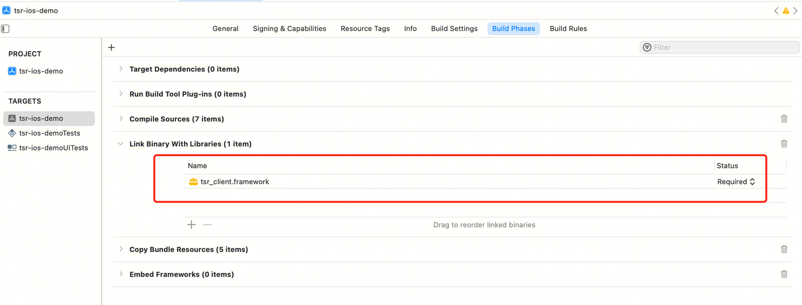
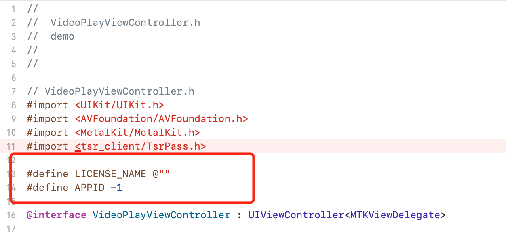

# Quick Start


## 1.1 SDK Licensing Application


### 1.1.1 Required Authorization Information


Please reach out to your Tencent Cloud business representative to activate TSR service. You will need to provide the following information regarding the app that will integrate the SDK: Tencent Cloud account APPID, APP Bundle Identifier.


Your APPID can be found within your Tencent Cloud "Account Center" -> "Account Information" -> "Basic Information".

The Bundle Identifier can be viewed within an Xcode project by navigating to "TARGETS" -> "General" -> "Identity" -> "Bundle Identifier".


Required Information
<table>
<tr>
<td rowspan="1" colSpan="1" >Info</td>

<td rowspan="1" colSpan="1" >Value</td>
</tr>

<tr>
<td rowspan="1" colSpan="1" >APPID</td>

<td rowspan="1" colSpan="1" >12345678</td>
</tr>

<tr>
<td rowspan="1" colSpan="1" >Bundle Identifier</td>

<td rowspan="1" colSpan="1" >com.tencent.mps.ios-demo</td>
</tr>

<tr>
<td rowspan="1" colSpan="1" >SDK edition</td>

<td rowspan="1" colSpan="1" >Standard Edition/ Professional Edition</td>
</tr>
</table>


The authorization scheme involves application and verification. Application happens once per validity period, allowing online authentication during TSRSDK initialization if the APP has internet access. The service must be renewed upon expiry.


### 1.1.2 Activate the MPS Console


To ensure that the service can be properly authorized, you also need to activate the Media Processing Service (MPS) Console on the Tencent Cloud official website. Activation link:：[https://console.tencentcloud.com/mps](https://console.tencentcloud.com/mps)


## 1.2 Compilation and Execution of the Demo Project

Download the source code of the Demo project [here](https://github.com/tencentyun/TSR/tree/main/demo/tsr-ios-demo).

Alter the demo's Bundle Identifier and provide it to Tencent Cloud business services. Refer to the previous "SDK Authorization Application" steps to acquire the SDK and authorization files, then configure them within the Demo project. The procedure is as follows:


1. Open the project in Xcode and drag the SDK into the project directory. Ensure "Copy items if needed" is selected and verify that "Link Binary With Libraries" includes the SDK.




2. Within the "TARGETS" -> "General" -> "Frameworks, Libraries, and Embedded Content" section, configure the SDK's "Embed" setting to "Embed & Sign".

   
3. Drag the certificate into the project directory under tsr-ios-demo, and ensure that "Target Membership" is selected.

4. Fill in the licenseName and appId in VideoPlayViewController.h
   
5. Execute the demo.


## 1.3 Demo App Experience

None


# 2 SDK Integration Guide

### 2.1 Program Flow

### 2.1.1 TSRSdk
The TSRSdk encompasses two primary methods: ``initWithAppId:authId:sdkLicenseVerifyResultCallback:tsrLogger:`` and ``deInit``. The ``initWithAppId:authId:sdkLicenseVerifyResultCallback:tsrLogger:`` method is designated for initializing the SDK, while the ``deInit`` method is employed for the liberation of resources.


1. To initialize the TSRSdk for online authentication, you must provide the APPID and AUTH_ID for authentication purposes. The method ``initWithAppId:authId:sdkLicenseVerifyResultCallback:tsrLogger:`` requires the input of `TSRSdkLicenseVerifyResultCallback` to retrieve the results of the online authentication. Additionally, a `TSRLogger` must be supplied to obtain the SDK's logs. Below is the sample code:

   ``` plaintext
   - (void)onTSRSdkLicenseVerifyResult:(TSRSdkLicenseStatus)status {
      if (status == TSRSdkLicenseStatusAvailable) {
      // Creating TSRPass for super-resolution rendering
      } else {
      // Do something when the verification of sdk's license failed.
      }
   }
   
   // Init TSRSdk and verify the online license
   [TSRSdk.getInstance initWithAppId:APPID authId:AUTH_ID sdkLicenseVerifyResultCallback:self tsrLogger:[[Logger alloc] init]];
   ```


2. When you no longer require the use of TSRSdk, it is necessary to invoke the deInit method of TSRSdk to release resources.

   ``` plaintext
   // Release resources when the TSRSdk object is no longer needed.
   [TSRSdk.getInstance deInit];
   ```


### 2.1.2 TSRPass

TSRPass is a class designed for executing super-resolution rendering, encompassing methods such as init, setParametersWithBrightness, and render. Upon creating a TSRPass instance, it is imperative to specify the super-resolution algorithm type by passing in TSRAlgorithmType.

Within the TSRAlgorithmType enumeration, there are three algorithm execution modes: TSRAlgorithmTypeStandard, TSRAlgorithmTypeProfessionalHighQuality, and TSRAlgorithmTypeProfessionalFast.


- TSRAlgorithmTypeStandard (Standard) Mode: Offers rapid super-resolution processing speeds, making it suitable for scenarios that demand high real-time performance. In this mode, a notable enhancement in image quality can be achieved.

- TSRAlgorithmTypeProfessionalHighQuality (Professional Edition - High Quality) Mode: The mode ensures superior image quality while requiring higher device performance. It is ideal for scenarios with stringent image quality demands and is recommended for use on mid to high-end smartphones.

- TSRAlgorithmTypeProfessionalFast (Professional Edition - Fast) Mode: The mode guarantees quicker processing speeds at the expense of some image quality. It is well-suited for scenarios that demand high real-time performance and is recommended for use on mid-range smartphones. It encompasses the init, render, and deInit methods. Before utilizing TSRPass, you must invoke the init method to initialize it. Upon completion of its use, you must call the deInit method to release resources.


Please note:
- TSRPass employs the Metal framework for super-resolution rendering, necessitating devices that support Metal.

- TSRPass is not thread-safe and must be invoked within the same thread.

- The Professional version algorithm, TSRAlgorithmTypeProfessionalFast, requires an iOS system version of 15.0 or higher to be effective.

- The Professional version algorithm, TSRAlgorithmTypeProfessionalHighQuality, necessitates an iOS system version of 16.0 or higher to function properly.


Prior to utilizing TSRPass, it is imperative to initialize the system by invoking the method.`initWithTSRAlgorithmType:device:inputWidth:inputHeight:srRatio:initStatusCode:`


``` plaintext
 TSRInitStatusCode initStatus;

 # TSRAlgorithmTypeStandard
  _tsr_pass_standard = [[TSRPass alloc] initWithTSRAlgorithmType:TSRAlgorithmTypeStandard device:_device inputWidth:_videoSize.width inputHeight:_videoSize.height srRatio:_srRatio initStatusCode:&initStatus];
 
 # TSRAlgorithmTypeProfessionalFast
  _tsr_pass_professional_fast = [[TSRPass alloc] initWithTSRAlgorithmType:TSRAlgorithmTypeProfessionalFast device:_device inputWidth:_videoSize.width inputHeight:_videoSize.height srRatio:_srRatio initStatusCode:&initStatus];
 
 # TSRAlgorithmTypeProfessionalHighQuality
 _tsr_pass_professional_high_quality = [[TSRPass alloc] initWithTSRAlgorithmType:TSRAlgorithmTypeProfessionalHighQuality device:_device inputWidth:_videoSize.width inputHeight:_videoSize.height srRatio:_srRatio initStatusCode:&initStatus];
```

If you need to adjust the input image dimensions or the super-resolution magnification factor during use, you can call the `reInit` method to reinitialize.

```objective-c
// Reinitializing TSRPass with new dimensions and super-resolution ratio
TSRInitStatusCode reInitStatus = [_tsr_pass reInit:newInputWidth inputHeight:newInputHeight srRatio:newSrRatio];
if (reInitStatus == TSRInitStatusCodeSuccess) {
    // Continue with rendering or other operations
} else {
    // Handle reinitialization failure
}
```

Upon initializing TSRPass, you may optionally adjust the rendering parameters by invoking the method setParametersWithBrightness:saturation:contrast:.
``` plaintext
  // Optional. Sets the brightness, saturation and contrast level of the TSRPass. The default value is set to (50, 50, 50). 
  // Here we set these parameters to slightly enhance the image.
 [_tsr_pass setParametersWithBrightness:52 saturation:55 contrast:60];
```


The ``render:commandBuffer:`` method applies a super-resolution rendering process to the input image, enhancing its quality. The processed image is rendered onto an `MTLTexture` within the `TSRPass` object. The method returns an `MTLTexture` that has undergone super-resolution rendering.


``` plaintext
   _sr_texture = [_tsr_pass render:_in_texture commandBuffer:commandBuffer];
```

When you no longer require the use of TSRPass, it is necessary to invoke the deInit method of TSRPass to release resources.
``` plaintext
// Release resources when the TSRPass object is no longer needed.
[_tsr_pass deInit];
```


### 2.1.3 TIEPass
### 2.1.3 TIEPass

TIEPass is a class designed for image enhancement rendering, available exclusively in the Professional Edition SDK. It encompasses the methods `init`, `render`, `renderWithPixelBuffer`, `reInit` and `deInit`. Prior to utilizing TIEPass, it is imperative to invoke the `init` method for initialization. When creating TIEPass, it is necessary to input `TIEAlgorithmType` to set the algorithm type for image enhancement.

Within the `TIEAlgorithmType` enumeration, there exist two algorithm execution modes:
1. `TIEAlgorithmTypeProfessionalHighQuality`: Ensures superior image quality while demanding higher device performance. It is ideal for scenarios requiring high-quality images and is recommended for use on mid-to-high-end smartphones.
2. `TIEAlgorithmTypeProfessionalFast`: Offers faster processing with some image quality reduction, ideal for real-time needs on mid-range smartphones.

**Please be advised:**
- TIEPass is not thread-safe and must be invoked within the same thread.
- The Professional Edition algorithm, `TIEAlgorithmTypeProfessionalFast`, requires an iOS system version of 15.0 or higher to function effectively.
- The Professional Edition algorithm, `TIEAlgorithmTypeProfessionalHighQuality`, necessitates an iOS system version of 16.0 or higher to be operational.

* Before utilizing TIEPass, it is imperative to initialize it by invoking the `initWithTIEAlgorithmType:algorithmType:device:inputWidth:inputHeight:initStatusCode:` method.
```objective-c
 TIEInitStatusCode initStatus;
 
 // FAST
_tie_pass_fast = [[TIEPass alloc] initWithTIEAlgorithmType:TIEAlgorithmTypeProfessionalFast device:_device inputWidth:200 inputHeight:200  initStatusCode:&initStatus];
 // HIGH_QUALITY
 _tie_pass_high_quality = [[TIEPass alloc] initWithTIEAlgorithmType:TIEAlgorithmTypeProfessionalHighQuality device:_device inputWidth:200 inputHeight:200  initStatusCode:&initStatus];
```

* If you need to adjust the input image dimensions during use, you can call the `reInit` method to reinitialize.
```objective-c
// 重新初始化TIEPass以适应新的图像尺寸
TIEInitStatusCode reInitStatus = [_tie_pass reInit:newInputWidth inputHeight:newInputHeight];
if (reInitStatus == TIEInitStatusCodeSuccess) {
    // 继续进行图像处理或其他操作
} else {
    // 处理重新初始化失败的情况
}
```

* When you no longer require the use of TIEPass, it is necessary to invoke the deInit method of TIEPass to release resources.
``` plaintext
// Release resources when the TIEPass object is no longer needed.
[_tie_pass deInit];
```


### 2.1.4 TSRLogger


TSRLogger is designed to capture internal logs from the SDK. Please ensure these logs are written to a file to facilitate the troubleshooting of external network issues.


## 3 SDK API Description

You may click the link to access the API documentation for TSRSDK, which includes annotations for the interfaces and examples of how to call them.

[TSRSDK IOS API Document](https://tencentyun.github.io/TSR/ios-docs/1.10/index.html)

