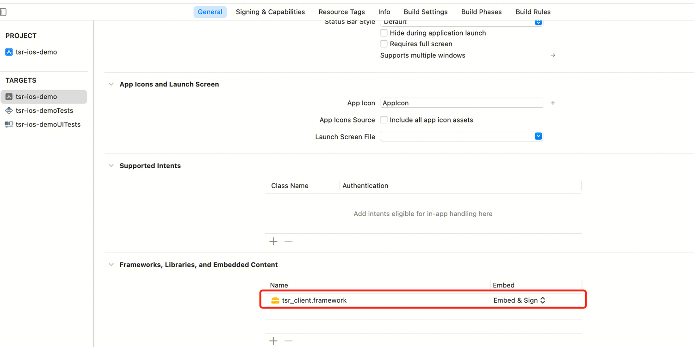

# **1 快速开始**
## 1.1 **SDK授权申请**
### 1.1.1 **授权所需信息**
请联系您的腾讯云商务开通服务。您需要提供将要集成SDK的APP的这些信息：**腾讯云账号APPID**、**APP的Bundle Identifier**。

* APPID可以在您的腾讯云【账号中心】->【账号信息】->【基本信息】中查看。
* Bundle Identifier可以在xcode项目中的【TARGETS】-> 【General】-> 【Identity】-> 【Bundle Identifier】查看。

#### 例：提供的信息
|信息|值|
| ------ | ----------- |
|APPID|12345678|
|Bundle Identifier|com.tencent.mps.ios-demo|
|SDK版本|标准版/专业版|

授权方案分为授权申请和授权验证两个过程，其中授权申请在授权有效期内，只会进行一次。授权服务开通后，您可以在初始化TSRSDK时使用在线方式进行鉴权，APP需要有访问网络权限。授权服务具有有效期限，当授权过期失效后需要重新获取授权。

### **1.1.2 开通测试授权**
为了服务能够正常授权，您还需要在腾讯云官网开通【媒体处理（MPS）控制台】。开通链接：https://console.cloud.tencent.com/mps

开通【媒体处理（MPS）控制台】后，可以参照[文档教程](https://doc.weixin.qq.com/doc/w3_AOcASwZGACk0FEPdUPJSfWATJijrR?scode=AJEAIQdfAAoiwZesQAAcEALgZGALo)。的方式，自行开通测试授权。

## 1.2 **Demo工程编译运行**

下载Demo工程的[源码](https://github.com/tencentyun/TSR/tree/main/demo/tsr-ios-demo)。

修改demo的Bundle Ientifier，并将Bundle Ientifier提供给腾讯云商务，参考前面“SDK授权申请”步骤，获取SDK和授权文件，配置到Demo工程中。操作如下：
1. 使用xcode打开工程项目，将sdk拖入工程的目录下。勾选Copy items if needed，并检查Link Binary With Libraries是否已经包含sdk
   
   
   
2. 在【TARGETS】-> 【General】-> 【Frameworks, Libraries, and Embedded Content】中设置SDK的【Embed】为"Embed & Sign"
   
3. 将证书拖入工程目录的tsr-ios-demo下，并确认【Target Membembership】已勾选。
4. 在VideoPlayViewController.h中填写appId
   
5. 运行demo

## **1.3 Demo App体验**
暂无


# 2 **SDK接入指南**
## **2.1 程序流程**


### **2.1.1 TSRSdk**
TSRSdk包括`initWithAppId:authId:sdkLicenseVerifyResultCallback:tsrLogger:`和`deInit`两个方法。`initWithAppId:authId:sdkLicenseVerifyResultCallback:tsrLogger:`方法用于初始化SDK，`deInit`方法用于释放资源。
1. 在线鉴权初始化TSRSdk，您需要传入**APPID和AUTH_ID**用于鉴权，`initWithAppId:authId:sdkLicenseVerifyResultCallback:tsrLogger:`需要传入TSRSdkLicenseVerifyResultCallback用于获取在线鉴权的结果，除此之外，还需要传入一个 TSRLogger，用于获取SDK的日志。下面是示例代码：
```
- (void)onTSRSdkLicenseVerifyResult:(TSRSdkLicenseStatus)status {
   if (status == TSRSdkLicenseStatusAvailable) {
   // Creating TSRPass for super-resolution rendering
   } else {
   // Do something when the verification of sdk's license failed.
   }
}

// Init TSRSdk and verify the online license
[TSRSdk.getInstance initWithAppId:APPID authId:AUTH_ID sdkLicenseVerifyResultCallback:self tsrLogger:[[Logger alloc] init]];
```


2. 当您已经不需要使用TSRSdk时，需要调用TSRSdk的deInit方法，释放资源。
```
// Release resources when the TSRSdk object is no longer needed.
[TSRSdk.getInstance deInit];
```
### **2.1.2 TSRPass**

TSRPass是用于进行超分辨率渲染的类，它包括了`init`、`setParametersWithBrightness`、`render`和`reInit`方法。在创建TSRPass时，您需要传入`TSRAlgorithmType`设置超分的算法类型。

在`TSRAlgorithmType`枚举中，有以下三个算法运行模式：
1. `TSRAlgorithmTypeStandard`（标准）模式：提供快速的超分辨率处理速度，适用于高实时性要求的场景。在这种模式下，可以实现显著的图像质量改善。
2. `TSRAlgorithmTypeProfessionalHighQuality`（专业版-高质量）模式：确保了高图像质量，同时需要更高的设备性能。它适合于有高图像质量要求的场景，并推荐在中高端智能手机上使用。
3. `TSRAlgorithmTypeProfessionalFast`（专业版-快速）模式：在牺牲一些图像质量的同时，确保了更快的处理速度。它适合于有高实时性要求的场景，并推荐在中档智能手机上使用。

**注意：**
- TSRPass使用Metal框架进行超分辨率渲染，需要设备支持Metal。
- TSRPass不是线程安全的，必须在同一个线程中调用TSRPass的方法。
- 专业版算法`TSRAlgorithmTypeProfessionalFast`需要iOS系统版本在15.0或以上才生效。
- 专业版算法`TSRAlgorithmTypeProfessionalHighQuality`需要iOS系统版本在16.0或以上才生效。

在使用TSRPass前，您需要调用`initWithTSRAlgorithmType:device:inputWidth:inputHeight:srRatio:initStatusCode:`方法进行初始化。
```objective-c
TIEInitStatusCode initStatus;

# TSRAlgorithmTypeStandard
_tsr_pass_standard = [[TSRPass alloc] initWithTSRAlgorithmType:TSRAlgorithmTypeStandard device:_device inputWidth:_videoSize.width inputHeight:_videoSize.height srRatio:_srRatio initStatusCode:&initStatus];

# TSRAlgorithmTypeProfessionalFast
_tsr_pass_professional_fast = [[TSRPass alloc] initWithTSRAlgorithmType:TSRAlgorithmTypeProfessionalFast device:_device inputWidth:_videoSize.width inputHeight:_videoSize.height srRatio:_srRatio initStatusCode:&initStatus];

# TSRAlgorithmTypeProfessionalHighQuality
_tsr_pass_professional_high_quality = [[TSRPass alloc] initWithTSRAlgorithmType:TSRAlgorithmTypeProfessionalHighQuality device:_device inputWidth:_videoSize.width inputHeight:_videoSize.height srRatio:_srRatio initStatusCode:&initStatus];
```

如果在使用过程中需要调整输入图像的尺寸或超分辨率的放大因子，可以调用`reInit`方法进行重新初始化。
```objective-c
// Reinitializing TSRPass with new dimensions and super-resolution ratio
TSRInitStatusCode reInitStatus = [_tsr_pass reInit:newInputWidth inputHeight:newInputHeight srRatio:newSrRatio];
if (reInitStatus == TSRInitStatusCodeSuccess) {
    // Continue with rendering or other operations
} else {
    // Handle reinitialization failure
}
```

* 初始化TSRPass且TSRInitStatusCode为TSRInitStatusCodeSuccess，您可以通过调用`setParametersWithBrightness:saturation:contrast:`调整渲染的参数值(可选)
```
  // Optional. Sets the brightness, saturation and contrast level of the TSRPass. The default value is set to (52, 55, 60, 0). 
  // Here we set these parameters to slightly enhance the image.
 [_tsr_pass setParametersWithBrightness:52 saturation:55 contrast:60 sharpness:0];
```
* `render:commmandBufffer:`方法将超分辨率渲染过程应用于输入图像，提高其质量。处理后的图像渲染在TSRPass对象内的MTLTexture上。返回的是已执行超分辨率渲染的MTLTexture。
```
   _sr_texture = [_tsr_pass render:_in_texture commandBuffer:commandBuffer];
```

* 当您已经不需要使用TSRPass时，需要调用TSRPass的deInit方法，释放资源。
```
// Release resources when the TSRPass object is no longer needed.
[_tsr_pass deInit];
```

TSRPass类还提供了接口用于管理和优化超分辨率渲染过程中的专业版超分辨率（Pro SR）功能。以下是对这四个接口的详细介绍：

1. **enableProSRAutoFallback:timeoutDurationMs:fallbackListener:**
   该方法用于启用专业版超分辨率的自动回退机制。您可以设置连续超时帧数（consecutiveTimeoutFrames）和超时持续时间（timeoutDurationMs），以便在超分辨率处理未能在指定时间内完成时自动回退到默认处理方式。此外，您还可以传入一个回退监听器（fallbackListener），用于处理回退事件的回调。这使得在处理过程中能够更灵活地应对性能问题，确保用户体验的流畅性。

2. **disableProSRAutoFallback:**
   该方法用于禁用专业版超分辨率的自动回退机制。如果您希望在超分辨率处理过程中不使用自动回退功能，可以调用此方法。这对于需要严格控制渲染流程的场景非常有用。

3. **benchmarkProSR:**
   该方法用于对专业版超分辨率进行基准测试。您需要传入输入图像的宽度（inputWidth）、高度（inputHeight）和超分辨率比率（srRatio），该方法将返回一个整数值，表示在给定尺寸和超分辨率比率下的处理性能。这可以帮助开发者评估不同图像尺寸和超分辨率设置下的处理效率，从而优化应用的性能。

4. **forceProSRFallback:**
   该方法用于强制启用或禁用专业版超分辨率的回退功能。通过传入一个布尔值（enable），您可以控制是否在处理过程中强制使用回退机制。这对于调试和测试场景非常有用，允许开发者在需要时快速切换到默认处理方式。

这些接口为开发者提供了灵活的控制选项，以优化超分辨率渲染的性能和用户体验。

### **2.1.3 TIEPass**
TIEPass是用于进行图像增强渲染的类，**只在专业版SDK可用**。它包括`init`、`render`、`renderWithPixelBuffer`、`reInit`和`deInit`方法。在使用TIEPass前，您需要调用`init`方法进行初始化。在创建TIEPass时，您需要传入`TIEAlgorithmType`设置图像增强的算法类型。

在`TIEAlgorithmType`枚举中，有以下两个算法运行模式：
1. `TIEAlgorithmTypeProfessionalHighQuality`（专业版-高质量）模式：确保了高图像质量，同时需要更高的设备性能。它适合于有高图像质量要求的场景，并推荐在中高端智能手机上使用。
2. `TIEAlgorithmTypeProfessionalFast`（专业版-快速）模式：在牺牲一些图像质量的同时，确保了更快的处理速度。它适合于有高实时性要求的场景，并推荐在中档智能手机上使用。

**注意：**
- TIEPass不是线程安全的，必须在同一个线程中调用TIEPass的方法。
- 专业版算法`TIEAlgorithmTypeProfessionalFast`需要iOS系统版本在15.0或以上才生效。
- 专业版算法`TIEAlgorithmTypeProfessionalHighQuality`需要iOS系统版本在16.0或以上才生效。

* 在使用TIEPass前，您需要调用`initWithTIEAlgorithmType:algorithmType:device:inputWidth:inputHeight:initStatusCode:`方法进行初始化。

```
 TIEInitStatusCode initStatus;
 
 // FAST
_tie_pass_fast = [[TIEPass alloc] initWithTIEAlgorithmType:TIEAlgorithmTypeProfessionalFast device:_device inputWidth:200 inputHeight:200  initStatusCode:&initStatus];
 // HIGH_QUALITY
 _tie_pass_high_quality = [[TIEPass alloc] initWithTIEAlgorithmType:TIEAlgorithmTypeProfessionalHighQuality device:_device inputWidth:200 inputHeight:200  initStatusCode:&initStatus];
```

* 如果在使用过程中需要调整输入图像的尺寸，可以调用`reInit`方法进行重新初始化。

```objective-c
// 重新初始化TIEPass以适应新的图像尺寸
TIEInitStatusCode reInitStatus = [_tie_pass reInit:newInputWidth inputHeight:newInputHeight];
if (reInitStatus == TIEInitStatusCodeSuccess) {
    // 继续进行图像处理或其他操作
} else {
    // 处理重新初始化失败的情况
}
```

* 当您已经不需要使用TIEPass时，需要调用TIEPass的deInit方法，释放资源。
```
// Release resources when the TIEPass object is no longer needed.
[_tie_pass deInit];
```

TIEPass类还提供了接口用于管理和优化图像增强过程中的专业版图像增强（Pro IE）功能。以下是对这四个接口的详细介绍：

1. **enableProIEAutoFallback:timeoutDurationMs:fallbackListener:**
   该方法用于启用专业版图像增强的自动回退机制。您可以设置连续超时帧数（consecutiveTimeoutFrames）和超时持续时间（timeoutDurationMs），以便在图像增强处理未能在指定时间内完成时自动回退到默认处理方式。此外，您还可以传入一个回退监听器（fallbackListener），用于处理回退事件的回调。这使得在处理过程中能够更灵活地应对性能问题，确保用户体验的流畅性。

2. **disableProIEAutoFallback:**
   该方法用于禁用专业版图像增强的自动回退机制。如果您希望在图像增强过程中不使用自动回退功能，可以调用此方法。这对于需要严格控制图像处理流程的场景非常有用。

3. **benchmarkProIE:**
   该方法用于对专业版图像增强进行基准测试。您需要传入输入图像的宽度（inputWidth）和高度（inputHeight），该方法将返回一个整数值，表示在给定尺寸下的处理性能。这可以帮助开发者评估不同图像尺寸下的处理效率，从而优化应用的性能。

4. **forceProIEFallback:**
   该方法用于强制启用或禁用专业版图像增强的回退功能。通过传入一个布尔值（enable），您可以控制是否在处理过程中强制使用回退机制。这对于调试和测试场景非常有用，允许开发者在需要时快速切换到默认处理方式。

这些接口为开发者提供了灵活的控制选项，以优化图像增强的性能和用户体验。

### **2.1.4 TSRLogger**
TSRLogger用于接收SDK内部的日志，请将这些日志写到文件，以便定位外网问题。

# **3 SDK API描述**
您可以点击连接查看TSRSDK的API文档，内含接口注释与调用示例。

[TSRSDK IOS API文档](https://tencentyun.github.io/TSR/ios-docs/1.12/index.html)


