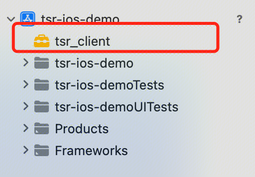

# **TSRSDK接入指南**
| 接入平台                           |
|--------------------------------|
| [Android接入指南](#anchor-android) |
| [iOS接入指南](#anchor-ios)         |

# <a name="anchor-android">Android</a>
## 1. **SDK授权申请**
### 1.1 **授权所需信息**
请联系您的腾讯云商务开通服务。您需要提供将要集成SDK的App的这些信息：腾讯云账号APPID、App签名证书信息(签名证书的序列号、发布者、所有者)、App包名。

APPID可以在您的腾讯云【账号中心】->【账号信息】->【基本信息】中查看。
App签名证书信息可以使用keytool命令查看，例如
```keytool -list -v -keystore test.keystore```


除此之外，您还需要告知接入的SDK版本。SDK版本分为标准版与专业版： 
* 标准版：提供标准版超分辨率功能，实现快速的超分辨率处理速度，适用于高实时性要求的场景。在这种模式下，可以实现显著的图像质量改善。 
* 专业版：提供的功能包括标准版超分辨率、专业版超分辨率、专业版图像增强。专业版超分辨率和图像增强适用于高质量要求的场景，但对设备性能有一定要求，建议在中高端智能手机上使用。

提供的信息
|信息|值|
| :- | :- |
|APPID|12345678|
|包名|com.tencent.mps.srplayer|
|序列号|17ccecf2|
|所有者|test|
|发布者|test|
|SDK版本|标准版/专业版|

授权方案分为授权申请和授权验证两个过程，其中授权申请在授权有效期内，只会进行一次。授权服务开通后，您可以在初始化TSRSDK时使用在线方式进行鉴权，APP需要有访问网络权限。授权服务具有有效期限，当授权过期失效后需要重新获取授权。

### 1.2 **开通MPS控制台**
为了服务能够正常授权，您还需要在腾讯云官网开通【媒体处理（MPS）控制台】。开通链接：https://console.cloud.tencent.com/mps

## 2. **SDK接入指南**
### **2.1 程序流程**


#### **2.1.1 TSRSdk**
[TSRSdk](https://tencentyun.github.io/TSR/android-docs/com/tencent/mps/tie/api/TSRSdk.html)包括init和release两个方法。init方法用于初始化SDK，release方法用于释放资源。

1. 在线鉴权初始化TSRSdk，您需要传入APPID进行在线鉴权，还需要传入TSRSdk.TSRSdkLicenseVerifyResultCallback用于获取在线鉴权的结果。除此之外，还需要传入一个TSRLogger，用于获取SDK的日志。下面是示例代码：

```
    TSRSdkLicenseVerifyResultCallback callback = new TSRSdkLicenseVerifyResultCallback() {
    public void onTSRSdkLicenseVerifyResult(TSRSdkLicenseStatus status) {
        if (status == TSRSdkLicenseStatus.AVAILABLE) {
           // Creating TSRPass for super-resolution rendering
        } else {
           // Do something when the verification of sdk's license failed.
        }
    }
  };
  TSRSdk.getInstance().init(appId, callback, logger);
```


2. 当您已经不需要使用TSRSdk时，需要调用TSRSdk的release方法，释放资源。<font color="red">**注意：在调用TSRSdk的release方法前，确保所有TSRPass已经被release，否则会有意想不到的问题。**</font>
```
  // If you have created TSRPass, you should release it before release TSRSdk.
  tsrPass.release();
  // Release resources when the TSRSdk object is no longer needed.
  TSRSdk.getInstance().release();
```
#### **2.1.2 TSRPass**
[TSRPass](https://tencentyun.github.io/TSR/android-docs/com/tencent/mps/tie/api/TSRPass.html)是用于进行超分辨率渲染的类，在创建TSRPass时，您需要传入TSRAlgorithmType设置超分的算法类型。

在TSRAlgorithmType枚举中，有STANDARD、PROFESSIONAL两个算法运行模式：
1. STANDARD（标准）模式：提供快速的超分辨率处理速度，适用于高实时性要求的场景。在这种模式下，可以实现显著的图像质量改善。
2. PROFESSIONAL（专业）模式：更注重超分辨率效果，适用于高质量要求的场景。这种模式的超分辨率效果优于 STANDARD 模式，但对设备性能有一定要求，建议在中高端智能手机上使用。**需要注意的是，这种模式仅在专业版SDK中提供支持。**

它包括了init、render和release方法。在使用TSRPass前，您需要调用init方法进行初始化。在使用结束后，您需要调用release方法释放资源。

以下是代码示例：
```
// Create a TSRPass object using the constructor.
TSRPass tsrPass =  new TSRPass(TSRPass.TSRAlgorithmType.STANDARD);

// You can also create a PROFESSIONAL mode TSRPass.
// TSRPass tsrPassProfessional = new TSRPass(TSRPass.TSRAlgorithmType.PROFESSIONAL);

// The code below must be executed in glThread.
//----------------------GL Thread---------------------//
// Init TSRPass
tsrPass.init(inputWidth, inputHeight, srRatio);
// Sets the parameters of the TSRPass.
// These three parameters are empirical values and are only for reference. You can change their values according to your own needs.
tsrPass.setParameters(52, 52, 58);
// If the type of inputTexture is TextureOES, you must transform it to Texture2D.
int outputTextureId = tsrPass.render(inputTextureId);

//----------------------GL Thread---------------------//

// Release resources when the TSRPass object is no longer needed.
tsrPass.release();
```

#### **2.1.3 TIEPass**
TIEPass是用于进行图像增强渲染的类，**只在专业版SDK可用**。它包括init、render和release方法。在使用TIEPass前，您需要调用init方法进行初始化。在使用结束后，您需要调用release方法释放资源。

以下是代码示例：
```
// Create a TIEPass object using the constructor.
TIEPass tiePass = new TIEPass();

// The code below must be executed in glThread.
//----------------------GL Thread---------------------//

// Init TIEPass
tiePass.init(inputWidth, inputHeight);
// If the type of inputTexture is TextureOES, you must transform it to Texture2D.
int outputTextureId = tiePass.render(inputTextureId);

//----------------------GL Thread---------------------//

// Release resources when the TIEPass object is no longer needed.
tiePass.release();
```

#### **2.1.4 TSRLogger**
[TSRLogger](https://tencentyun.github.io/TSR/android-docs/com/tencent/mps/tie/api/TSRLogger.html)用于接收SDK内部的日志，请将这些日志写到文件，以便定位外网问题。
### **2.2 API文档**
您可以点击连接查看TSRSDK的API文档，内含接口注释与调用示例。

[TSRSDK ANDROID API文档](https://tencentyun.github.io/TSR/android-docs/1.2/index.html)
### **2.3 体验Demo**
#### **2.3.1 安装包**
Android手机扫码后，用浏览器打开下载apk并安装Demo App，立即体验超分SDK效果。


#### **2.3.2 源码**
我们开放了体验Demo的工程[源码](https://github.com/tencentyun/TSR/tree/main/demo/tsr-android-demo)，供您接入参考。

为了编译运行，您需要先联系腾讯云商务获取SDK和授权，再配置到Demo工程中。步骤如下：

1. 将SDK放在工程的./SRPlayer/app/libs文件夹下。

2. 在MainActivity.java下配置初始化参数，在校验初始化需要腾讯云APPID。

   


3. 对APK进行签名
- 在Android Studio中，找到【File】-> 【Project Structure】 -> 【Modules】-> 【Signing Configs】中配置您的签名证书。
- 或者您可以在【Build】-> 【Generate Signed Bundle / APK】使用证书生成签名的APK
- 无论您使用哪种方式，<font color="red">**请确保配置的签名证书与提供给我们的信息一致。**</font>

4. 运行demo

# <a name="anchor-ios">iOS</a>
## 1. **SDK授权申请**
请联系您的腾讯云商务开通服务。您需要提供将要集成SDK的APP的这些信息：**腾讯云账号APPID**、**APP的Bundle Identifier**。

* APPID可以在您的腾讯云【账号中心】->【账号信息】->【基本信息】中查看。
* Bundle Identifier可以在xcode项目中的【TARGETS】-> 【General】-> 【Identity】-> 【Bundle Identifier】查看。

#### 例：提供的信息
|信息|值|
| ------ | ----------- |
|APPID|12345678|
|Bundle Identifier|com.tencent.mps.ios-demo|

授权方案分为授权申请和授权验证两个过程，其中授权申请在授权有效期内，只会进行一次。授权服务开通后，您可以在初始化TSRSDK时使用在线方式进行鉴权，APP需要有访问网络权限。授权服务具有有效期限，当授权过期失效后需要重新获取授权。

## 2. **SDK接入指南**
### **2.1 程序流程**


#### **2.1.1 TSRSdk**
TSRSdk包括`initWithAppId:sdkLicenseVerifyResultCallback:tsrLogger:`和`reset`两个方法。`initWithAppId:sdkLicenseVerifyResultCallback:tsrLogger:`方法用于初始化SDK，`reset`方法用于释放资源。
1. 在线鉴权初始化TSRSdk，您需要传入**APPID**用于鉴权，`initWithAppId:sdkLicenseVerifyResultCallback:tsrLogger:`需要传入TSRSdkLicenseVerifyResultCallback用于获取在线鉴权的结果，除此之外，还需要传入一个 TSRLogger，用于获取SDK的日志。下面是示例代码：
```
- (void)onTSRSdkLicenseVerifyResult:(TSRSdkLicenseStatus)status {
   if (status == TSRSdkLicenseStatusAvailable) {
   // Creating TSRPass for super-resolution rendering
   } else {
   // Do something when the verification of sdk's license failed.
   }
}

// Init TSRSdk and verify the online license
[TSRSdk.getInstance initWithAppId:APPID sdkLicenseVerifyResultCallback:self tsrLogger:[[Logger alloc] init]];
```


2. 当您已经不需要使用TSRSdk时，需要调用TSRSdk的reset方法，释放资源。
```
// Release resources when the TSRSdk object is no longer needed.
[TSRSdk.getInstance reset];
```
#### **2.1.2 TSRPass**
**注意：这个类使用Metal框架进行超分辨率渲染，需要设备支持Metal。**

TSRPass是用于进行超分辨率渲染的类，它包括了`initWithDevice:inputWidth:inputHeight:srRatio:`和`render:commandBuffer:`方法。

* 在使用TSRPass前，您需要调用`initWithDevice:inputWidth:inputHeight:srRatio:`方法进行初始化。

* 初始化TSRPass后，您可以通过调用`setParametersWithBrightness:saturation:contrast:`调整渲染的参数值

* `render:commmandBufffer:`方法将超分辨率渲染过程应用于输入图像，提高其质量。处理后的图像渲染在TSRPass对象内的MTLTexture上。返回的是已执行超分辨率渲染的MTLTexture。

#### **2.1.3 TSRLogger**
TSRLogger用于接收SDK内部的日志，请将这些日志写到文件，以便定位外网问题。
### **2.2 API文档**
您可以点击连接查看TSRSDK的API文档，内含接口注释与调用示例。

[TSRSDK IOS API文档](https://tencentyun.github.io/TSR/ios-docs/index.html)

### **2.3 体验Demo**

#### **2.3.1 源码**
我们开放了体验Demo的工程[源码](https://github.com/tencentyun/TSR/tree/main/demo/tsr-ios-demo)，供您接入参考。

为了编译运行，您需要先修改demo的Bundle Ientifier，并将Bundle Ientifier提供给腾讯云商务获取SDK和授权，再配置到Demo工程中。步骤如下：
1. 使用xcode打开工程项目，将sdk拖入工程的目录下。勾选Copy items if needed，并检查Link Binary With Libraries是否已经包含sdk
   
   
   
2. 在【TARGETS】-> 【General】-> 【Frameworks, Libraries, and Embedded Content】中设置SDK的【Embed】为"Embed & Sign"
   
3. 将证书拖入工程目录的tsr-ios-demo下，并确认【Target Membembership】已勾选。
4. 在VideoPlayViewController.h中填写appId
   
5. 运行demo

